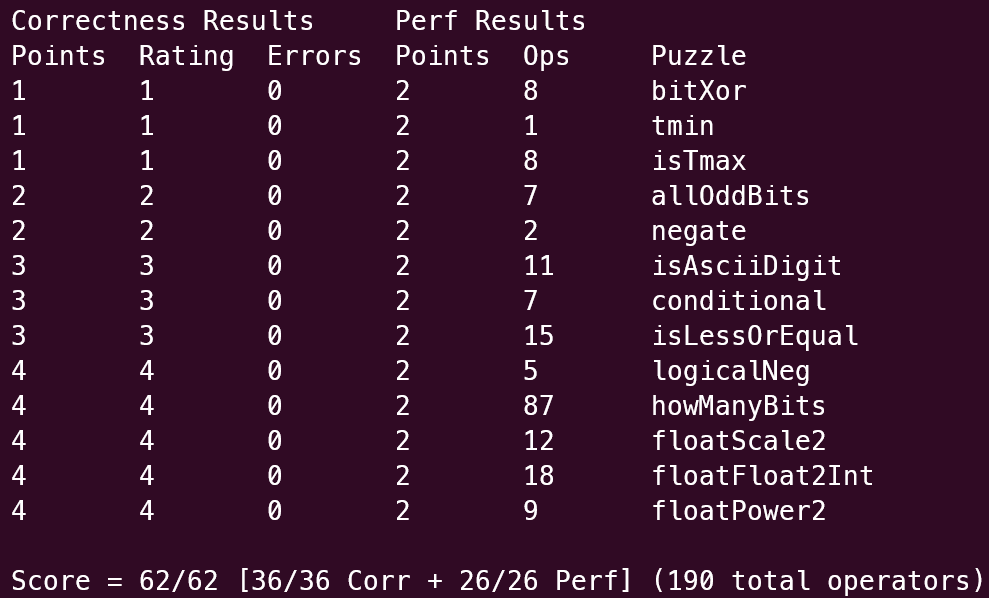

## 1.bitXor

这个似乎就是德摩根定律，但我对这方面没有什么了解，所以我的写法实际上是我尝试了几次后根据直觉得到的

不过事实证明我的写法没错

## 2.tmin

直接返回，没有什么好说的

## 3.isTmax

利用了 Tmax 的一个性质：Tmax+1 = ~Tmax，由于-1也满足这个性质，所以要排除-1（通过isMinus1来判断）

## 4.allOddBits

我的想法就是构造出0xaaaaaaaa这个数字，然后让x和这个数做&运算，就能取出x在相应位上的值，再与0xaaaaaaaa做^运算，如果符合要求的性质会得到0，否则会得到1.最后再做！运算

## 5.negate

就是利用了-x = ~x + 1

## 6.isAsciiDigit

我的想法就是分别取出这两位数然后进行比较，思路比较简单所以没什么好说的

## 7.conditional

我是首先注意到了`(y & ~temp) | (z & temp)` 这个表达式的值在temp为0x00000000时取y，在0xffffffff时取z，那么就需要构造一个表达式，使得x= =0时，temp为0xffffffff，x!=0时，temp取0x00000000。

所以就构造出了`temp = ~(!x) + 1` 。虽然会报warning，但因为不是error所以不管

## 8.isLessOrEqual

首先取出两个数的第一位，如果第一个数的第一位为1，第二个数的第一位为0，就不用比了。然后，只有这两个数的符号相同时（对应变量equalsign），再判断y-x的符号

## 9.logicalNeg

不难注意到，只有x=0时，作x | -x 得到的结果的符号位才会是0

利用这个性质就不难得到需要的表达式了

## 10.howManyBits

思路是二分法，先取出前16位，判断是否有1，再对pos做相应的运算

  

重复以上步骤，直到最后一位

  

不难发现无论是负数还是正数，都需要额外的一位表示，所以最后返回时直接加1

  

我发现如果不把所有变量都在第一行声明，./dlc会报错(parse error 和 undeclared variable)，所以在第一行声明所有变量

  

## 11.floatScale2

首先当然需要取出exp，sign，frac

当exp是255时，根据要求直接返回uf

exp是0时，说明是非规格化的浮点数，所以将尾数左移一位

初次之外，就是非规格化的浮点数，那么直接将exp加一即可

最后返回再次构建的浮点数

  

## 12.floatFloat2Int

同样取出exp sign frac这些数，但是为了方便取exp的实际值，减去单精度浮点数的偏移量127，同时取了加上隐藏位的frac

首先不考虑符号

由于32位int的范围大致为2的31次方，所以若exp大于31就需要返回要求的0x80000000u

同时如果exp<0，说明表达的数小于1，直接返回0

最简单的两种情况已经考虑完了，再考虑正常的情况，这时候如果指数位的值不为23，无论是大于还是小于，实际上都需要乘以相应的2的相应次方，这里通过移位实现。而如果exp恰好为23，那么这样的数强制转换后总为1，所以我默认让int_part取1

最后再处理符号

  

## 13.floatPower2

正常来说，x的取值范围会是[-126,127]，由于表示非规格化数时，尾数位实际上类似于指数位的作用，所以会有额外的23位，那么x的取值范围则是[-149,127]

所以，如果x>127，直接按照要求返回+INF

如果x在正常的取值范围，需要改变的只是指数位，所以将x加上偏移量再移位到正确的位置即可

如果是非规格化的浮点数，即x >= 149 ，那么就需要用到尾数位，所以直接移动

  

## Final.评测结果

如图，使用wsl2

_the result of datalab_

